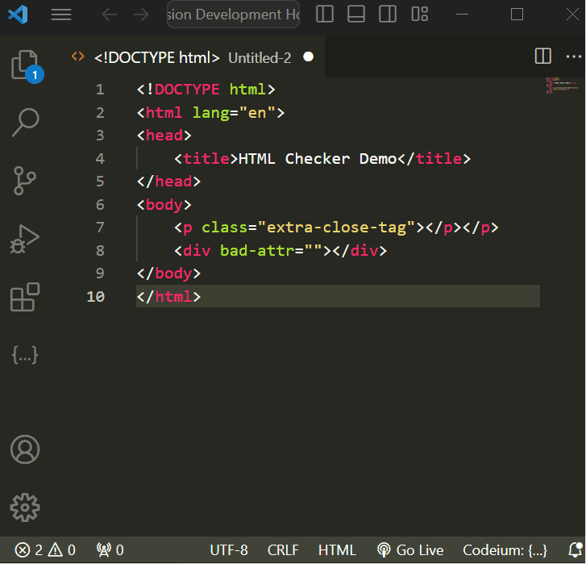

# HTML Checker

## Features

Uses the [Nu Html Checker](https://validator.github.io/validator/) to check HTML for issues like extra closing tags or bad practice.

Run ```Check HTML``` to validate.

> 

## Requirements

HTML Checker requires [Java 8+](https://www.java.com/en/download/) as of v2.0.0. If you don't want to install Java, install the extension at v1.3.1.

## Release Notes

### 2.0.0

- HTML Checker now runs locally with the [Nu Html Checker](https://validator.github.io/validator/) and requires Java.
- Instead of a webview, errors and warnings now show up as errors in the file
- Validation can now be done when a file is saved with the `html-validator: Validate-on-save` setting
- Removed the status bar button
- You can no longer filter errors

### 1.3.1

Allow adding file associations other than HTML through settings.

### 1.3.0

Added key command and status bar item to run command.
Press `alt+shift+c` to check HTML.

### 1.2.1

More static site generator filtering.

### 1.2.0

Allow ignoring of specific errors through settings.

### 1.1.0

Filter code from static site generators.

### 1.0.1

Only allow HTML files.

### 1.0.0

Initial release of HTML Checker.